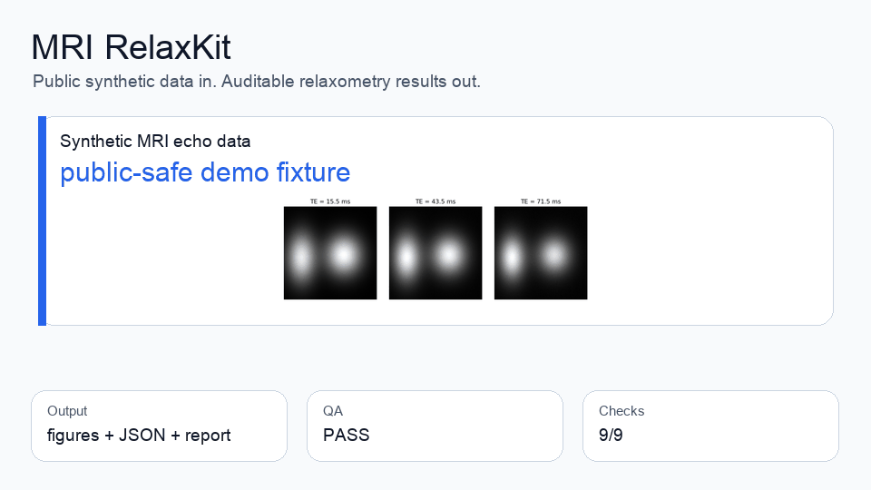
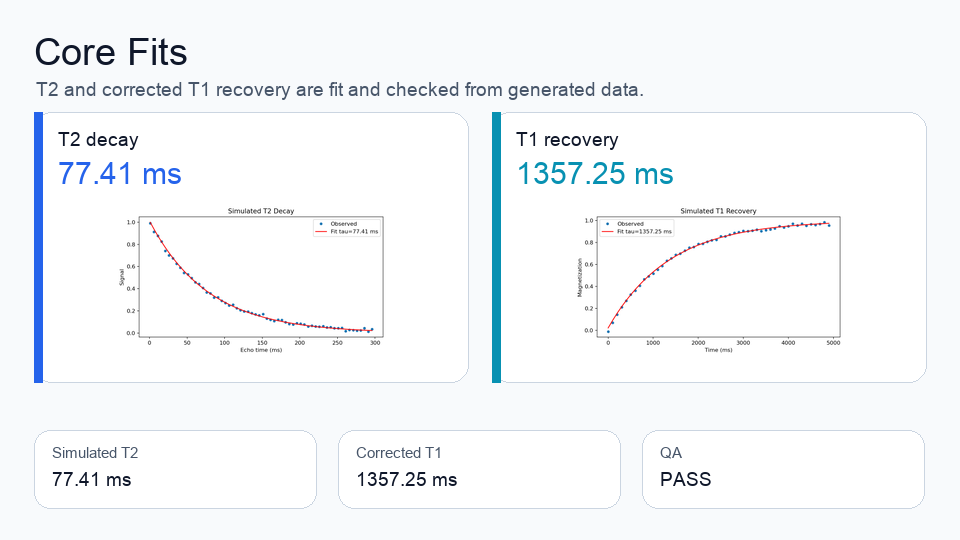
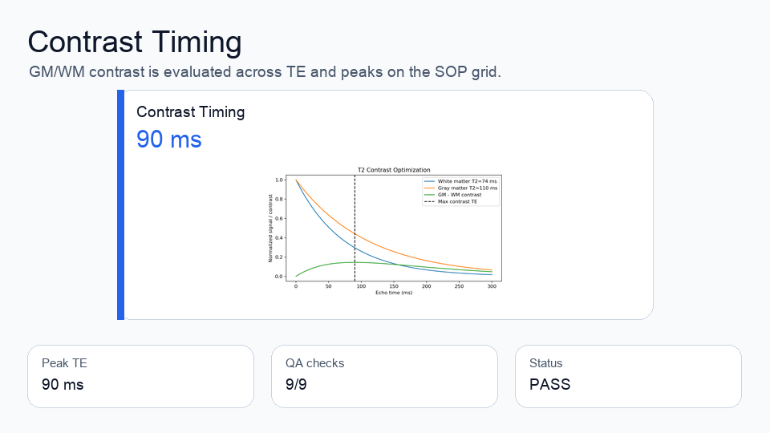
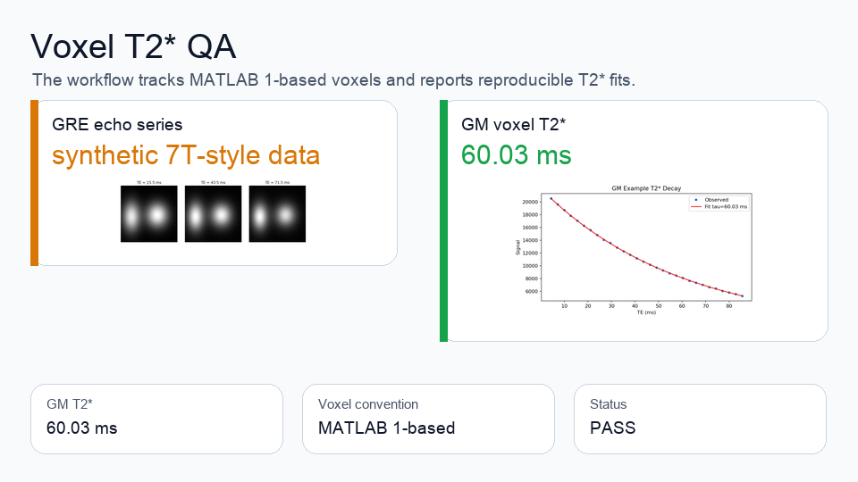

# MRI RelaxKit

<p align="center">
  
</p>

MRI RelaxKit turns MRI relaxometry teaching and QA data into reproducible fits, figures, metrics, and SOP reports without MATLAB.

## What It Produces

| Output | Public demo result | Why it matters |
| --- | ---: | --- |
| T2 decay fit | `77.41 ms` | Replaces manual script math with auditable fit parameters. |
| Corrected T1 recovery fit | `1357.25 ms` | Uses corrected recovery modeling plus nonlinear fit checks. |
| GM voxel T2* fit | `60.03 ms` | Makes voxel coordinate conventions explicit and reviewable. |
| GM/WM contrast timing | peak TE `90 ms` | Turns protocol contrast choices into a visible curve. |
| QA review | `PASS`, `9/9` checks | Leaves a machine-readable review trail for each run. |

## Visual Results

<table>
  <tr>
    <td></td>
    <td></td>
    <td></td>
  </tr>
  <tr>
    <td>T2 and corrected T1 fits</td>
    <td>GM/WM contrast timing</td>
    <td>Voxel T2* QA</td>
  </tr>
</table>

Every analysis run writes `metrics.json`, `qa.json`, `report.md`, `report.html`, and publication-ready figures.

## Run It

```bash
conda activate dl
python -m pip install -e ".[assets]"
python -m mri_relaxkit.cli demo-data --out outputs/demo/demo_relaxometry.mat
python -m mri_relaxkit.cli analyze --input outputs/demo/demo_relaxometry.mat --out outputs/demo/run
python -m mri_relaxkit.cli review --run outputs/demo/run
```

Regenerate the README visuals from the same public synthetic run:

```bash
python scripts/build_readme_assets.py --run outputs/demo/run --out-dir docs/assets
```

## Who It Is For

MRI RelaxKit is a B2B/B2Edu SOP and CLI toolkit for MRI course instructors, imaging research labs, imaging core facilities, and medtech/CRO imaging teams that need reproducible non-clinical relaxometry training or QA demos.

Teams use it to replace brittle MATLAB Live Script workflows with reviewable Python runs, explicit fit methods, clear voxel conventions, reproducible artifacts, and public-release checks.

## CLI

```bash
python -m mri_relaxkit.cli inspect outputs/demo/demo_relaxometry.mat
python -m mri_relaxkit.cli analyze --input outputs/demo/demo_relaxometry.mat --out outputs/demo/run
python -m mri_relaxkit.cli review --run outputs/demo/run
python -m mri_relaxkit.cli release-audit --root .
```

If you have private or institutional MAT data in the same schema, point `analyze` at that file. The public repository intentionally ships with synthetic demo data generation instead of redistributed course artifacts.

## Validation

```bash
conda activate dl
python -m pytest -q
python -m mri_relaxkit.cli release-audit --root .
```

## Boundary

MRI RelaxKit is for research, education, QA, and protocol-training workflows. It is not a clinical diagnostic product and is not validated as a regulated medical device.
